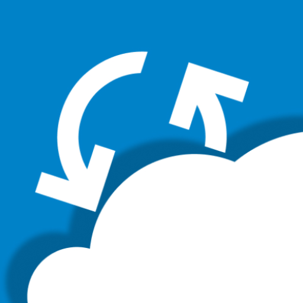

<div align="center">
  
  <h1>NextSync</h1>
  <p>Bidirectional file synchronization between Android and Nextcloud</p>

  <a href="https://github.com/DanyaSWorlD/NextSync/releases">
    
  </a>
  <a href="https://github.com/DanyaSWorlD/NextSync/blob/main/README.md">
    
  </a>
  
  
  <br/>
  
  
  
</div>

---

**NextSync** is a fast, lightweight Nextcloud file sync app for Android — no bloat, no distractions, just reliable syncing done right. Create sync tasks with configurable direction (upload, download, or bidirectional) and let the app handle the rest with periodic background sync and real-time file watching.

## Features

- **Nextcloud Login** — authenticate via the built-in WebView login flow; credentials stored locally
- **Sync Tasks** — name your tasks, pick local and remote folders, choose direction (ToCloud / ToDevice / bidirectional)
- **Folder Pickers** — browse local device storage and remote Nextcloud directories via WebDAV
- **Dashboard** — storage quota gauge, network & battery status, sync trigger, transfer stats
- **Background Sync** — automatic sync every 15 minutes via WorkManager; real-time `FileObserver` watching
- **Conflict Resolution** — local wins, remote wins, newer wins, keep both, or ask user
- **Progress Notifications** — transfer progress in the notification shade
- **Material Design 3** — light & dark theme with optional dynamic color (Android 12+)

## Screenshots

*Coming soon.*

## Download

<a href="https://play.google.com/store/apps/details?id=com.next.sync">
  
</a>
<a href="https://github.com/DanyaSWorlD/NextSync/releases">
  
</a>

Available on **Google Play** and [GitHub Releases](https://github.com/DanyaSWorlD/NextSync/releases).

## Building

```bash
git clone https://github.com/DanyaSWorlD/NextSync.git
cd NextSync
./gradlew :app:assembleDebug   # Build debug APK
./gradlew :app:test            # Run unit tests
./gradlew :app:lint            # Run Android lint
```

Open the project in **Android Studio** (Meerkat or later) for development.

## Tech Stack

| Concern | Library |
|---|---|
| Language | [Kotlin](https://kotlinlang.org/) 2.2.0 |
| UI | [Jetpack Compose](https://developer.android.com/jetpack/compose) + [Material 3](https://m3.material.io/) |
| DI | [Dagger Hilt](https://dagger.dev/hilt/) (kapt) |
| Database | [ObjectBox](https://objectbox.io/) |
| Navigation | [Navigation Compose](https://developer.android.com/guide/navigation/navigate) |
| Networking | [Nextcloud Android Library](https://github.com/nextcloud/android-library) (WebDAV) |
| Background | [WorkManager](https://developer.android.com/topic/libraries/architecture/workmanager) |
| Serialization | [kotlinx.serialization](https://github.com/Kotlin/kotlinx.serialization) |
| Image Loading | [Coil](https://coil-kt.github.io/coil/) |
| Permissions | [XXPermissions](https://github.com/getActivity/XXPermissions) |

## Architecture

Single-activity app with Compose Navigation (3 tabs: Home, Tasks, Options). ViewModels expose state via `StateFlow`. A custom event bus (`DataBus`) handles cross-component communication. The sync engine follows a chain-of-responsibility pattern with pluggable strategies.

```
app/src/main/java/com/next/sync/
├── App.kt                          # @HiltAndroidApp
├── MainActivity.kt                 # Single activity
├── ui/                             # Screens (Login, Home, Tasks, CreateTask, Options, FolderPicker)
├── core/sync/                      # ISyncTask chain, ISyncStrategy, NextSync orchestrator
├── core/db/                        # ObjectBox entities (AccountEntity, TaskEntity, FileStateEntity, DirectoryEntity)
├── core/di/                        # Hilt modules, DataBus, helpers
├── core/model/                     # Domain models (SyncFlowDirection, NetworkInfo, BatteryInfo, FileStateItem)
└── background/workers/             # SyncCheckWorker (periodic), UploadWorker, DownloadWorker
```

## Contributing

Contributions are welcome! Feel free to open an issue or submit a pull request.

## License

This project does not currently have a license. All rights reserved.
